#Ubuntu 20.04.2 无人值守安装流程

##常规步骤:

1.新建虚拟电脑

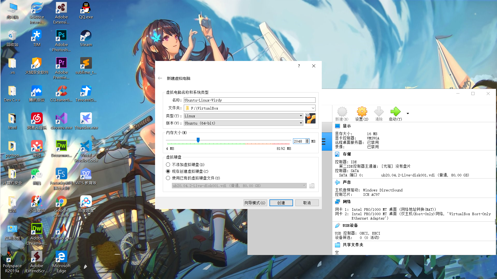

2.盘片、网卡等基本配置

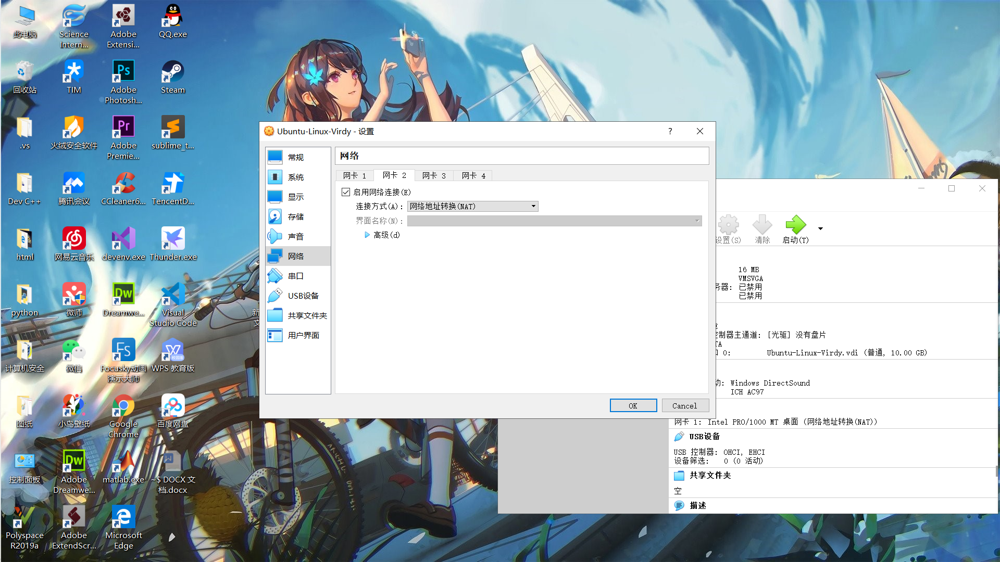

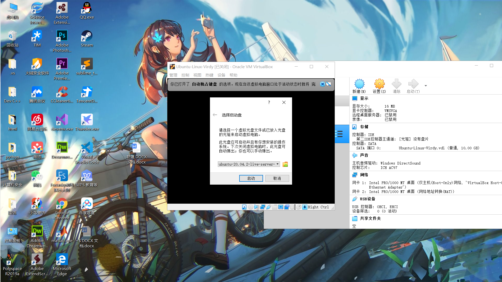

##无人值守安装里的安装选项

1.开始设置

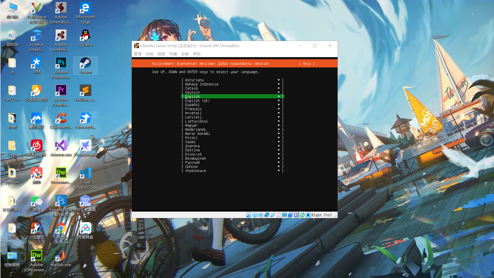

2.设置结束

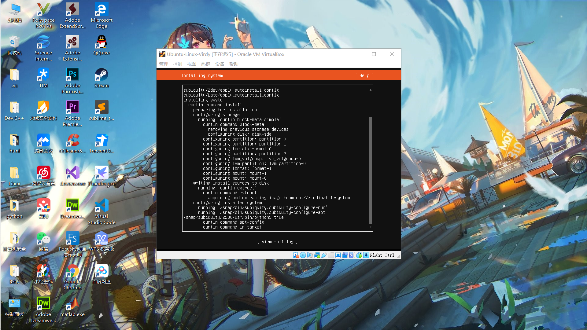

具体的每一个设置选项就不在此放出了，绝大多数都是直接选择Done的默认选项

因为是教学环境所以连公私钥对也没有配置

因为需要等待一段时间，所以在设置完成后就离开了

很遗憾它出现了一些问题

##二次启动

在我回到电脑前的时候界面已经变成了这样

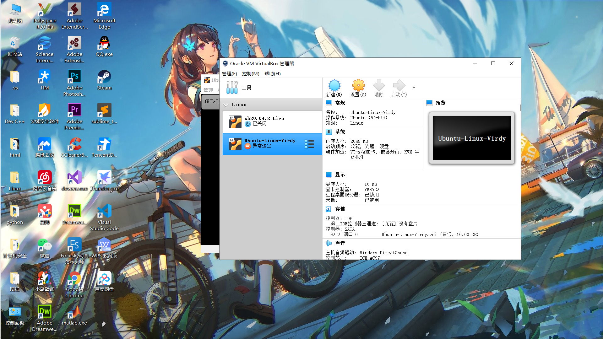

可能是哪里出了问题。再次启动虚拟机时，得把上面的步骤再来一次了

downloading and installing security updates

正在更新，需要等一会儿了

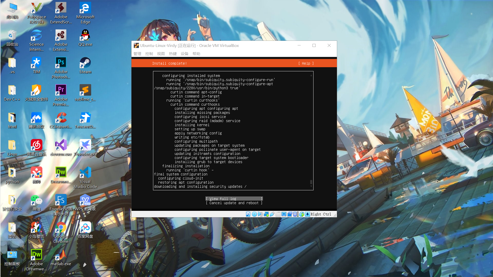

##最终完成

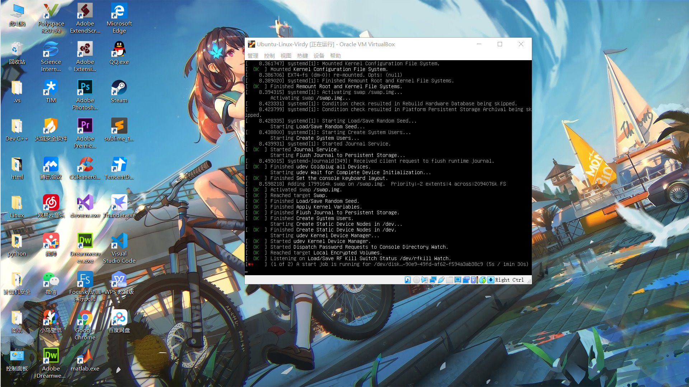

可以成功启动Linux系统了，有人值守的手动安装就此结束

###后话

最终的登入界面

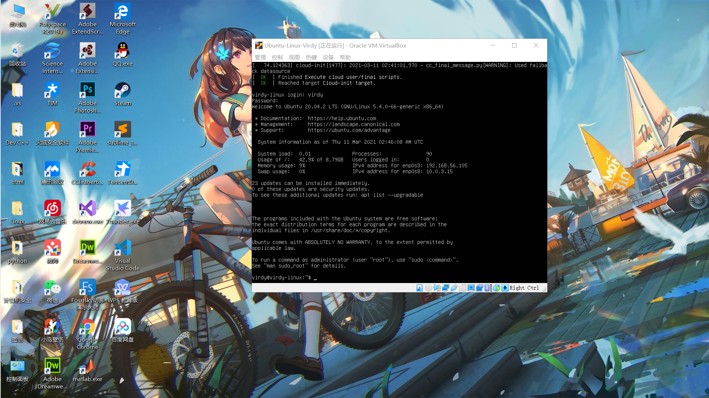

##创建新的虚拟机

这个虚拟机将在后来测试无人值守安装是否能够成功

通过github上提供的文件和自己新建的空白文件夹构架了iso镜像的两个基础文件

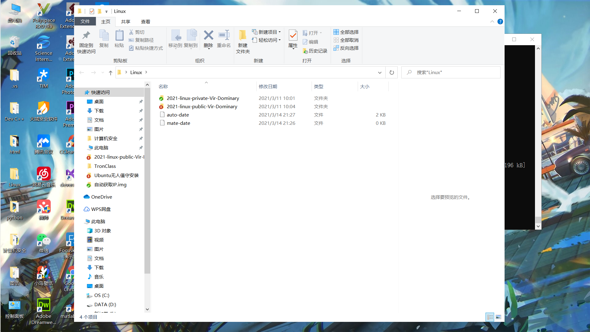

借助其他软件（filezilla）的功能来将文件传输到虚拟机上

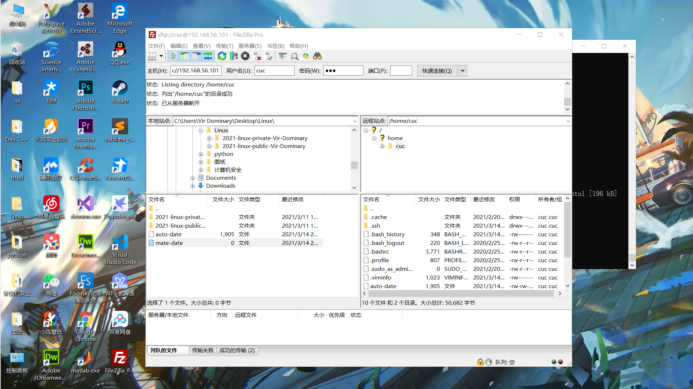

将传输过去的两个文件整合成iso镜像

命令为：

sudo apt install cloud-image-utils
cloud-localds ~/test.iso user-data meta-data
生成iso镜像

依然用FileZilla将镜像复制到主机上

选择盘片和该镜像，打开我们刚刚预设的测试用虚拟机

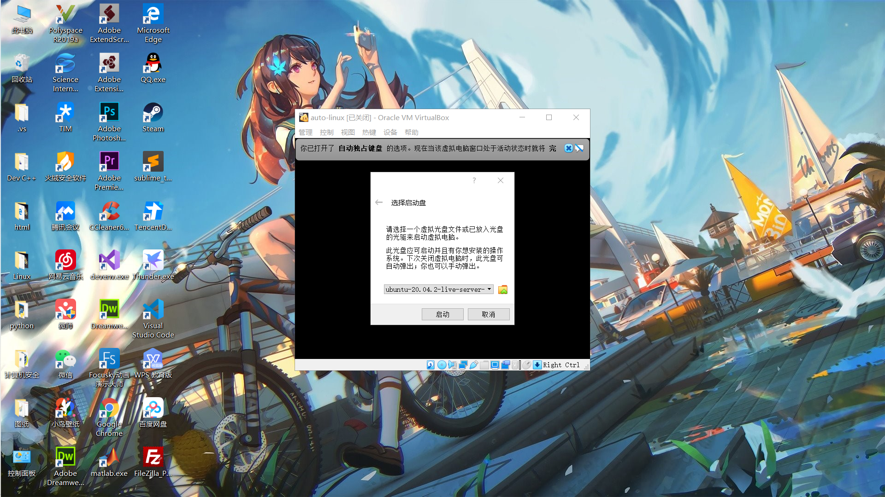

最终，这个虚拟机的安装系统只需要选择yes即可，如图

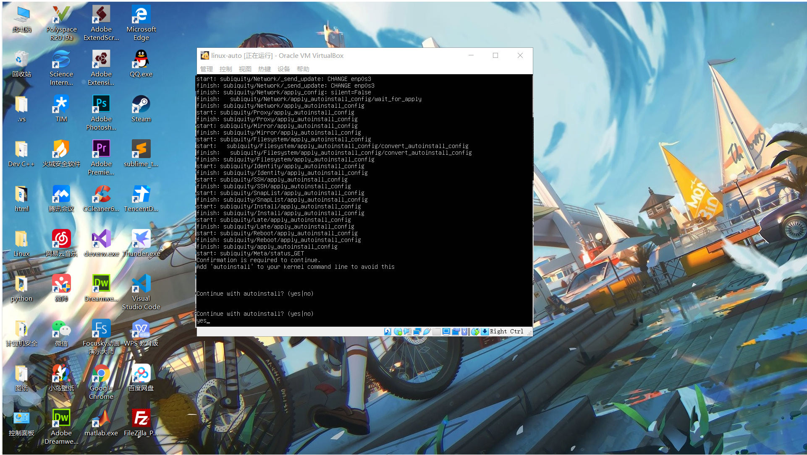

#新网卡的自动取用和自动获取IP

让新网卡自动取用和获取IP的过程比较简单，首先使用vim打开配置信息：

sudo vim /etc/netplan/00-installer-config.yaml

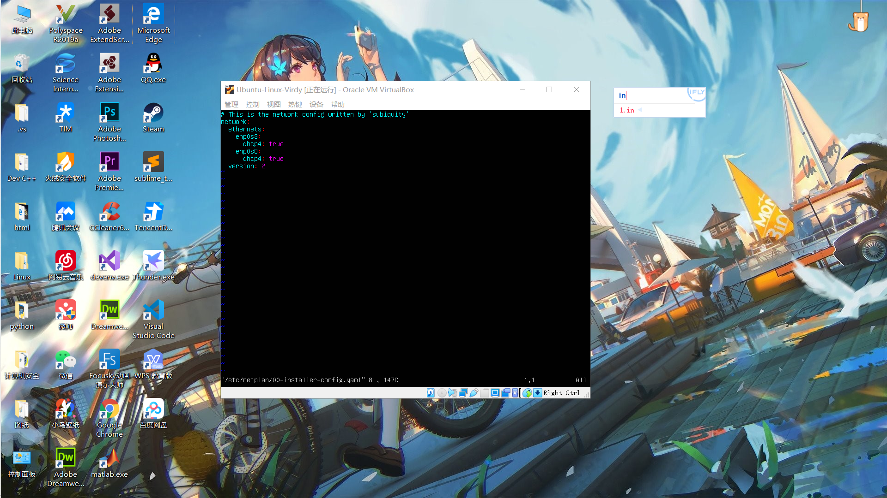

这里已经有我们此前配置的两张网卡enp0s3和enp0s8了，我们在此基础上额外添加enp0s13

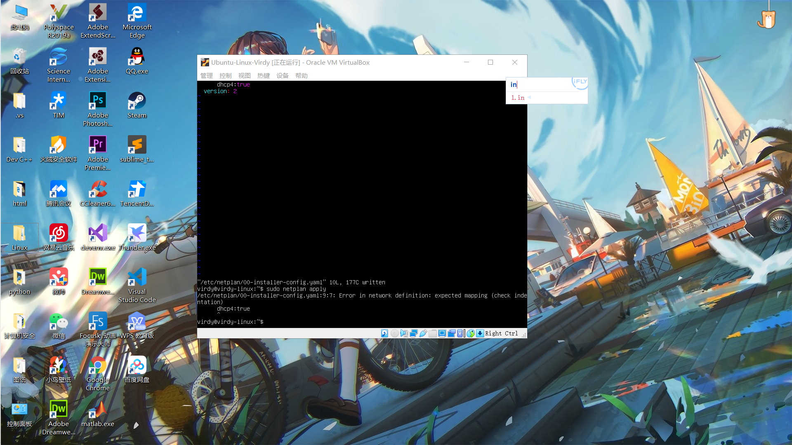

sudo netplan apply 使它生效

查看全部的网卡

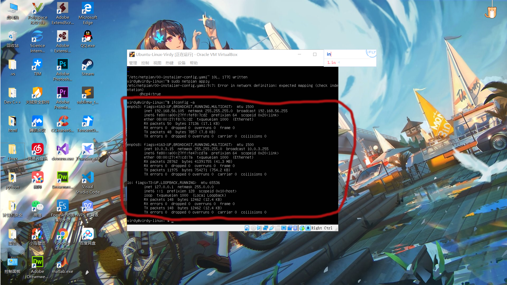

查看正在工作的网卡

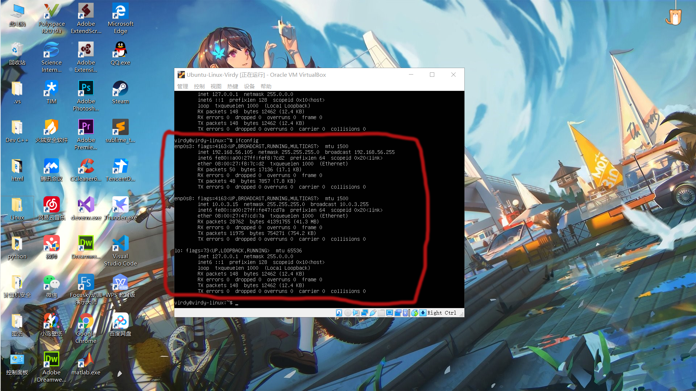

可以看到网卡确实正常工作了

参考文献：https://ubuntu.com/server/docs/network-configuration

