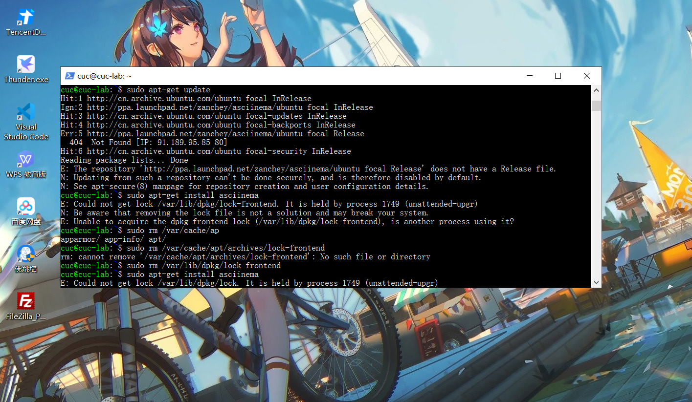
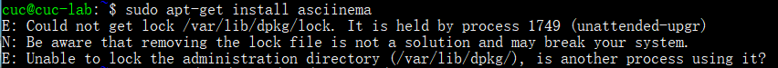
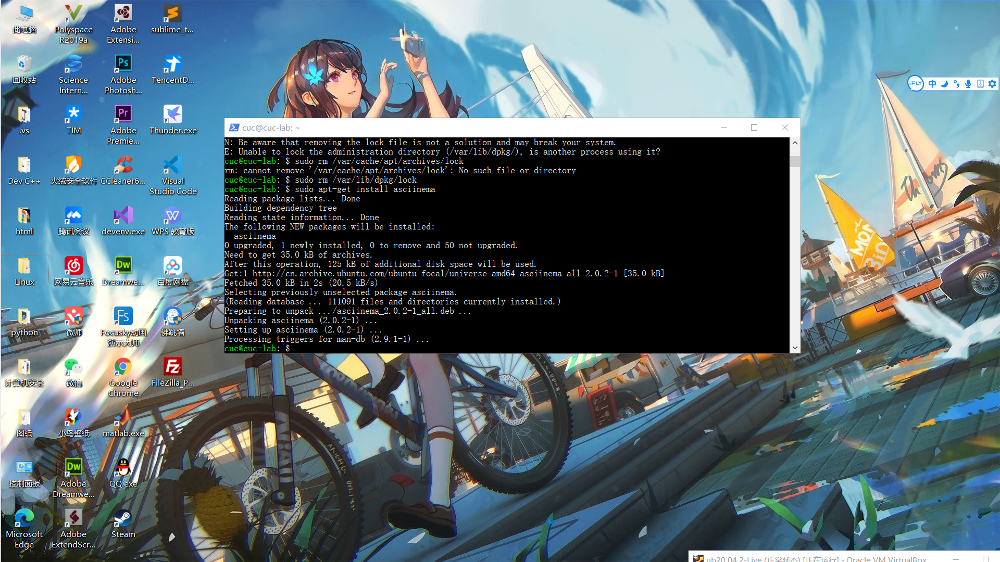

#asciinema录屏实验报告

##一.安装asciinema

用asciinema给出的官方命令输入，以装载asciinema

sudo apt-add-repository ppa:zanchey/asciinema
sudo apt-get update
sudo apt-get install asciinema

但在执行install句时出现报错：

E: Could not get lock /var/lib/dpkg/lock-frontend. It is held by process 1749 (unattended-upgr)
N: Be aware that removing the lock file is not a solution and may break your system.
E: Unable to acquire the dpkg frontend lock (/var/lib/dpkg/lock-frontend), is another process using it?

这个错误可能是由于另一个程序还在运行导致的资源不可用，因此我们需要将此前运行的程序关闭

输入：
sudo rm /var/cache/apt/archives/lock-frontend
sudo rm /var/lib/dpkg/lock-frontend

执行install语句，再次报错：

E: Could not get lock /var/lib/dpkg/lock. It is held by process 1749 (unattended-upgr)
N: Be aware that removing the lock file is not a solution and may break your system.
E: Unable to lock the administration directory (/var/lib/dpkg/), is another process using it?

路径最后的lock-frontend变成了lock，因此我们输入：
sudo rm /var/cache/apt/archives/lock
sudo rm /var/lib/dpkg/lock

再次输入install句即可

成功安装asciinema。

##录制Vimtutor的七个lesson，链接如下：

###lesson1：https://asciinema.org/a/rn725T6j7rcgCuZlHuA3ODWvU

###lesson2：https://asciinema.org/a/4eOeL9T79KtFBkoamIami7IsY

###lesson3：https://asciinema.org/a/AyIuYWvUq2ZbS1fzqEhneNuL6

###lesson4：https://asciinema.org/a/M2jtm1iFwsk7nEq3N9mv8sO50

###lesson5: https://asciinema.org/a/qxvdNzqOkf4vDOXxU1vcLIFqK

###lesson6: https://asciinema.org/a/1JanTX5HIjWh2AoDaDjbK1ZdX

###lesson7：https://asciinema.org/a/dieo4Xz97NngB5DAo5Nax9NXC